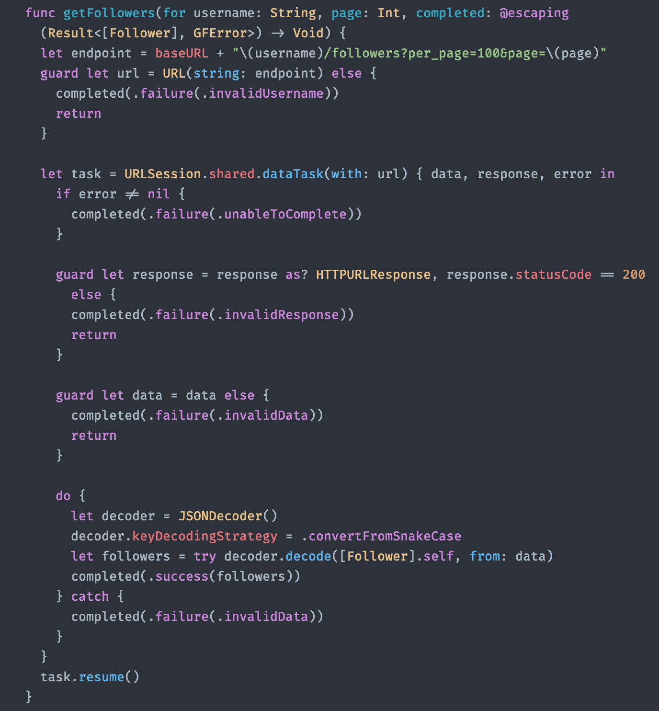

# ⚫️ One Dark Theme (for Xcode)

This is a port of [xcode-one-dark](https://github.com/bojan/xcode-one-dark)

## Screenshot



## Installation

### Swift Package Manager (Easiest way - Recommended)

* Clone the repo
* Execute `swift run`

```bash
git clone https://github.com/SwiftyJourney/OneDarkTheme.git
cd OneDarkTheme
swift run
```

> Under the hood it will install [Fira Code](https://github.com/tonsky/FiraCode) font too.

* (Optional) Remove the cloned project

```bash
cd ..
rm -rf OneDarkTheme
```

### Manual

* Download [Fira Code](https://github.com/tonsky/FiraCode)
* Add the fonts from `ttf` folder into your `Font Book` app
* Download and uncompress `OneDarkTheme`
* Copy `One Dark.xccolortheme` into `~/Library/Developer/Xcode/UserData/FontAndColorThemes`
  * If `UserData` and/or `FontAndColorThemes` don't exist, just create them.
* Open Xcode
  * Close it if it was already opened then open it again.
* Go to Preferences -> Themes
* Select `One Dark` theme.

## Attributions

* [Bojan Dimovski](https://github.com/bojan), for making a nice theme accessible for the iOS community.
* [John Sundell](https://github.com/JohnSundell), because thanks to his libraries and its own theme, made this great installation process easier.
